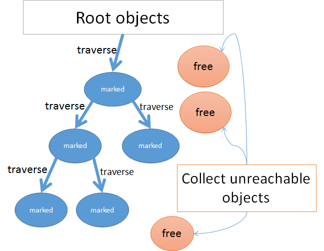
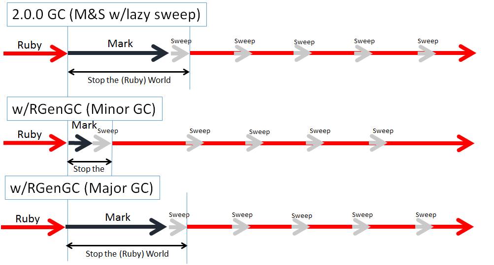
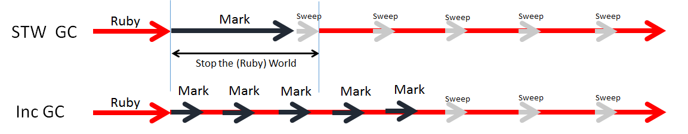
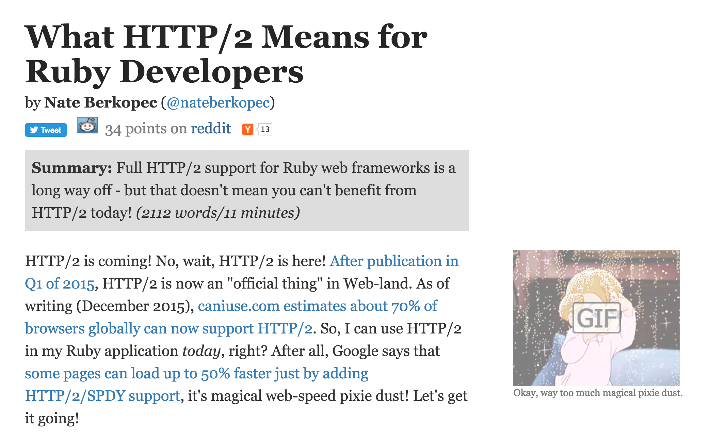

# [fit] A People's History 
# of the 
# [fit] Ruby Garbage Collector

@nateberkopec

---

---

# [fit] Beginner-friendly

---

# [fit] How do we reduce 
# [fit] GC pauses?

---

# [fit] 1.8
# [fit] Mark and Sweep

---

# [fit] ObjectSpace
# [fit] is a list of _RVALUEs_

---

# `rvalue` - list of flags, some object info

---

# [fit] The ObjectSpace is 
# [fit] a list of ~16KB _pages_ of ~400 RValues

---

# [fit] What triggers GC?

---

# Run out of open slots for new RVALUEs or hit off-ObjectSpace ("malloc") limits

---

---

# [fit] `FL_MARK` flag

---

# [fit] Mark -> Sweep -> Mark -> Sweep

---

# [fit] No Ruby 
# [fit] can be executed

---

# [fit] 1.8 REE
# [fit] Copy on Write

A Phusion project

---

# [fit] Forking
# [fit] webservers

---

# [fit] Shared vs 
# [fit] private memory

---

# [fit] Touching `RValue` 

---

# [fit] 1.9(.3)
# [fit] Lazy Sweep
# [fit] by Narihiro Nakamura

---

# [fit] Don't sweep 
# [fit] 'til you need it 
# [fit] _object allocation_

---

# [fit] Sweep until 
# [fit] free object is found

---

# [fit] Decrease
# [fit] worst-case times

---

# [fit] Mark -> Sweep -> Sweep -> Sweep -> Mark

---

# [fit] 2.0
# [fit] Bitmap Marking
# [fit] by Narihiro Nakamura

---

# [fit] Keep the mark bit
# [fit] somewhere else!

---
    
# [fit] The bitmap
# [fit] smaller, efficient

---

# [fit] Copy on Write friendly
# [fit] yay!

--- 

# [fit] Mark -> Sweep -> Sweep -> Sweep -> Mark

---

# [fit] 2.1
# [fit] Generational GC - RGenGC
# [fit] by Koichi Sasada

---

# [fit] Marked objects 
# [fit] are also marked "old" (3 survivals)

---

# [fit] Minor/Major GCs

---
# [fit] Problem:
# [fit] Keeping track of new objects

---

# [fit] Black 
# [fit] Gray
# [fit] White

---
  
# [fit] The write-barrier

---

# [fit] Sunny/shady objects

---

# [fit] WB protected/unprotected

---

# [fit] Shady/unprotected objects
# [fit] are never "old"

---

# [fit] Remembered set

---

---

# [fit] 2.2
# [fit] Incremental GC
# [fit] by Koichi Sasada

---

---

# [fit] "Interleave" major GC

---

# [fit] Total GC time remains same

---

# [fit] OOBGC
# [fit] not really required

---

# [fit] Black objects can
# [fit] now refer to white

---

# [fit] Write barrier
# [fit] tracks new objects

---

# [fit] GC.stat
 
---

# [fit] Symbol GC

---

# [fit] 2.3
# New Write Barrier

---

> We can assume new objects referred from old objects are maybe long-lived old objects

---

# [fit] Didn't work?

---

# [fit] 2.4
# More little changes

---

# [fit] Free slot control 

---

# [fit] The Future
# [fit] Compacting GC

---

# [fit] JRuby/Truffle already do this

---

# [fit] Aaron's work

---

# [fit] Old/New Pages
# [fit] Improve CoW Performance

---

# [fit] Guilds

---
# [fit] More Reading

## Pat Shaughnessy
## Koichi Sasada
## Sam Saffron

---

# 350+ pages, 18+ hours of video
# [fit] railsspeed.com

---

---

# [fit] speedshop.co

---

# [fit] Thanks!
## Slides and notes on Twitter
## @nateberkopec
## speedshop.co & railsspeed.com

Tell me your problems!